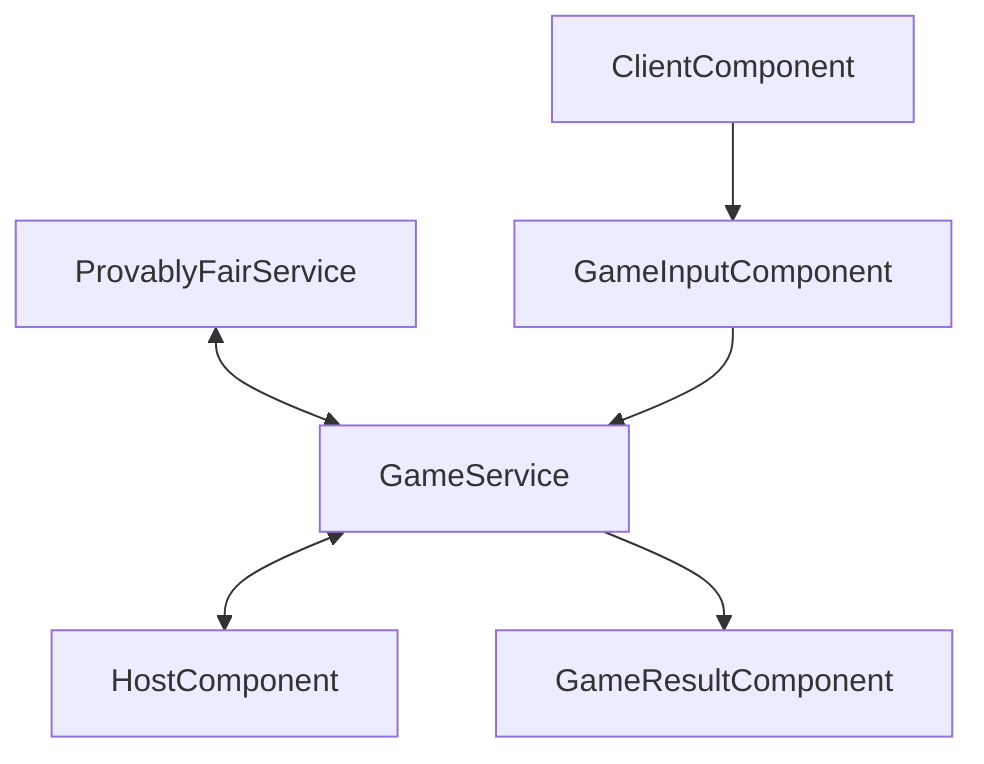

# Provably Fair

Sandbox for learning [Angular](https://angular.io) by implementing Provably Fair

## What is Provably Fair

In the context of online gambling or other types of online games, "provably fair" refers to a system in which the fairness of the game can be verified by the players. This typically involves the use of cryptographic techniques to ensure that the outcome of the game cannot be manipulated by either the game operator or the players.

In a provably fair system, the game operator typically provides a seed value or other input to the game's random number generator (RNG). The RNG is then used to generate the outcome of the game. The game operator also provides a cryptographic hash of the seed value, which allows the players to verify that the game was played fairly.

To verify the fairness of the game, the players can use the provided seed value and hash to reproduce the game's outcome and compare it to the outcome that was actually generated by the RNG. If the outcomes match, the players can be confident that the game was played fairly and that the outcome was not manipulated by either the game operator or the players.

Provably fair systems are designed to provide transparency and fairness in online games, and are particularly useful in games of chance where the outcome is determined by random events.

## Example

    /* 
     * To create a roll number, we use a client seed, a server seed, and a nonce to generate a number between 0 and 99.99.
     * This is done by first obtaining a number between 0 and 999.999, and then applying a modulus of 10^4 to get a value between 0 and 9999.
     * This value is then divided by 10^2 to obtain the final roll number between 0 and 99.99.
     */ 
    function roll(clientSeed, serverSeed, nonce) {
        const input = `${clientSeed}-${nonce}`
        const hash = HmacSHA512(input, serverSeed).toString(enc.Hex)

        let index = 0
        let roll = 0

        do {
            index++
            roll = parseInt(hash.substring(index * 5, index * 5 + 5), 16)

            if (index * 5 + 5 > 128) {
                roll = 99.99
                break
            }
        } while (roll >= Math.pow(10, 6))

        roll %= Math.pow(10, 4)
        roll /= Math.pow(10, 2)

        return roll
    }

## Diagram

